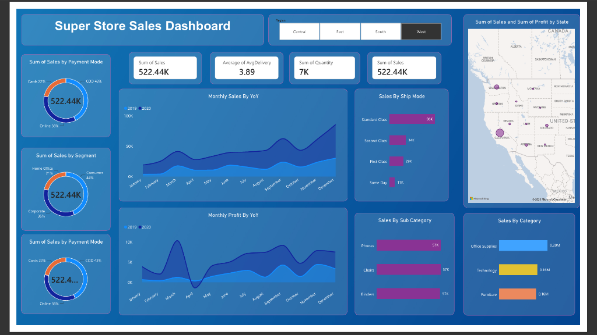
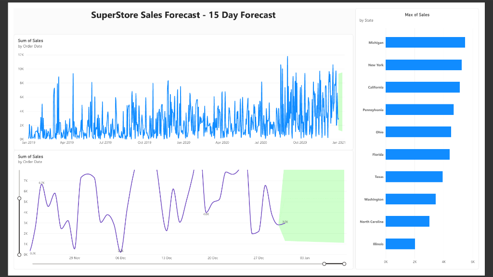

# 📊 SuperStore Sales Dashboard

[](https://powerbi.microsoft.com/)
[](dax/measures.md)
[](#)

An end-to-end sales analytics dashboard built in Power BI, analyzing retail sales performance and forecasting future sales trends using the SuperStore dataset.
---

## 📌 Dashboard Previews

### Page 1: Sales & Performance Overview


### Page 2: 15-Day Sales Forecast & State Analysis


---

## 🏢 Business Problem & Objectives

Retail leadership requires visibility into transaction dynamics, customer segment behavior, shipping efficiency, and regional profitability to drive operational decisions:
1. **Revenue & Profit Tracking**: Identify top-performing categories, sub-categories, and regions.
2. **Shipping & Operations**: Measure average fulfillment time across different shipping modes.
3. **Customer Payment Preferences**: Understand adoption of COD, Online, and Card transactions.
4. **Predictive Planning**: Forecast revenue 15 days into the future to optimize inventory and supply chain throughput.

---

## 📈 Key Insights & Findings

- **Dominant Segments & Channels**: 
  - **Consumer segment** drives the majority of revenue (**48%**), followed by **Corporate (33%)** and **Home Office (19%)**.
  - **Cash on Delivery (COD)** represents **43%** of payments, with Online (**36%**) and Cards (**22%**) trailing.
- **Fulfillment & Logistics**:
  - **Standard Class** accounts for the lion's share of shipment volume (**96K**), while maintaining an average order fulfillment duration of **~3.89 days**.
- **Product Category Leaders**:
  - **Office Supplies** generates highest volume (**$0.20M**), with **Phones**, **Chairs**, and **Binders** neck-and-neck as top sub-categories (**$57K** each).
- **Forecasting & Seasonality**:
  - Daily order volume shows strong cyclical spikes toward year-end (Q4 holiday ramp-up).
  - The 15-day forecast projects consistent demand with a 95% confidence interval, allowing proactive stock replenishment in key states like **Michigan, New York, and California**.

---

## 🛠️ Tech Stack & Methods

- **BI Tool**: Microsoft Power BI Desktop & Power BI Service
- **Data Modeling**: Star Schema with dedicated Calendar/Date dimension
- **ETL**: Power Query (data cleansing, type transformations, custom duration columns)
- **Analytics & Calculations**: DAX (Time Intelligence, YoY growth, Dynamic Rankings)
- **Database & Querying**: SQL (verification scripts for KPI validation)
- **Time Series Forecasting**: Power BI ETS (Exponential Smoothing) algorithm with 95% confidence bands

---

## 📂 Repository Structure

```plaintext
superstore-sales-forecast/
├── README.md                          # Comprehensive project documentation & showcase
├── .gitignore                         # Power BI temp files, backup and lock exclusions
├── SuperStore_Sales_Forecast.pbix     # Power BI Desktop report and model file
├── screenshots/
│   ├── page1-overview.png             # Clean capture of Overview Dashboard (Page 1)
│   └── page2-forecast.png             # Clean capture of 15-Day Forecast Report (Page 2)
├── data/
│   ├── README.md                      # Data dictionary and ETL pipeline documentation
│   └── SuperStore_Sales_Dataset.csv   # Retail sales raw dataset
├── dax/
│   └── measures.md                    # Catalog of key DAX formulas and business logic
├── sql/
│   └── analysis_queries.sql           # SQL scripts validating KPIs and distribution
└── docs/
    ├── data_model.md                  # Star schema architecture & relationships
    └── business_insights.md           # Executive recommendations & action plan
```

---


## 💡 Strategic Recommendations & SQL Validation

- **Executive Action Plan**: Read the complete strategic recommendations for supply chain staging, COD mitigation, and corporate upsell in [docs/business_insights.md](docs/business_insights.md).
- **SQL Analysis & KPI Validation**: Review backend SQL verification scripts in [sql/analysis_queries.sql](sql/analysis_queries.sql).

---

## 📐 Core DAX Measures Highlight

Here are sample measures utilized in the report (see [dax/measures.md](dax/measures.md) for full catalog):

```dax
// Average Delivery Turnaround
Avg Delivery Days = 
AVERAGEX(
    Orders,
    DATEDIFF(Orders[Order Date], Orders[Ship Date], DAY)
)

// YoY Sales Comparison
Sales SPLY = 
CALCULATE(
    [Total Sales],
    SAMEPERIODLASTYEAR('Calendar'[Date])
)

// YoY Revenue Growth %
YoY Sales Growth % = 
VAR _CurrentYear = [Total Sales]
VAR _PriorYear = [Sales SPLY]
RETURN
    DIVIDE(_CurrentYear - _PriorYear, _PriorYear, 0)
```

---

## 🚀 How to Run Locally

1. **Clone the repository**:
   ```bash
   git clone https://github.com/shivamraut747-ux/superstore-sales-forecast.git
   ```
2. **Open the Report**:
   - Ensure you have [Power BI Desktop](https://powerbi.microsoft.com/desktop/) installed.
   - Double-click `SuperStore_Sales_Forecast.pbix` to launch the dashboard.
3. **Data Refresh (Optional)**:
   - If prompted, update the data source path in **Transform Data > Data Source Settings** pointing to `data/SuperStore_Sales_Dataset.csv`.
   - Click **Refresh** in the Home ribbon.

## 👤 Author & Connect

- **Author**: Shivam Raut
- **Email**: shivamraut747@gmail.com
- **Portfolio**: [shivamraut.me](https://shivamraut.me)
