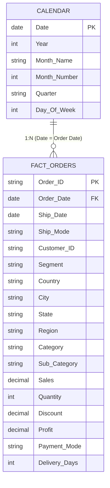

# Data Architecture & Star Schema Model

A robust data model is the backbone of high-performance Power BI reporting. This document details the underlying schema, dimension relationships, and modeling best practices implemented in this project.

---

## 🏗️ Conceptual Model Architecture

The data pipeline organizes transactional orders into a clean analytical model with a dedicated **Calendar Dimension** to support DAX time-intelligence operations (YoY, MoM, and 15-day forecasting).

---

## 🔗 Relationship Specifications

| From Table | To Table | Relationship | Cardinality | Cross Filter Direction | Purpose |
| :--- | :--- | :--- | :--- | :--- | :--- |
| `Calendar[Date]` | `Orders[Order Date]` | Active | 1 : Many (`1:*`) | Single (`Calendar` filters `Orders`) | Time Intelligence (`SAMEPERIODLASTYEAR`, YTD, Forecasting) |
| `Calendar[Date]` | `Orders[Ship Date]` | Inactive | 1 : Many (`1:*`) | Single | Available via `USERELATIONSHIP()` for fulfillment lead-time analysis |

---

## ⚡ Performance Optimization & Best Practices

1. **Star Schema Design**:
   - Fact table holds purely quantitative metrics (`Sales`, `Profit`, `Quantity`, `Discount`) and transactional foreign keys.
   - Continuous, contiguous Date table prevents standard Power BI auto-date-time table bloat, reducing memory footprint.

2. **Data Types & Memory Optimization**:
   - Converted high-precision decimals to Fixed Decimal Currency (`Currency` data type) to optimize VertiPaq engine compression.
   - Eliminated unused columns and verified proper integer encoding for date dimension keys.

3. **Single-Direction Filtering**:
   - Avoided bi-directional cross-filtering on relationships to eliminate ambiguity in filter propagation and prevent query degradation.
